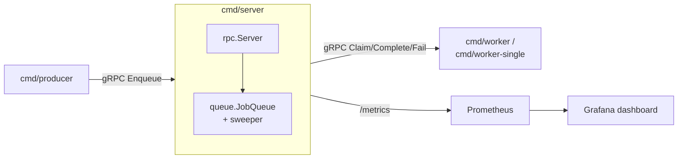
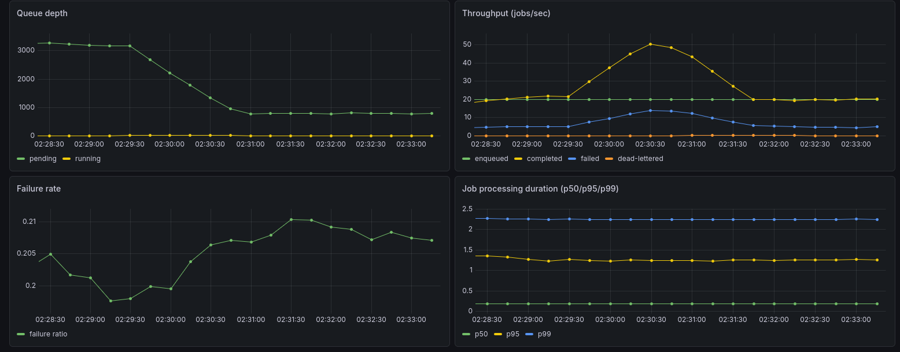

# job-queue

[](https://github.com/maxider/jobqueue/actions/workflows/ci.yml)
[](https://pkg.go.dev/github.com/maxider/job-queue/queue)
[](go.mod)
[](LICENSE)

A concurrent, lease-based job queue in Go, split into a gRPC server and
network clients, with Prometheus/Grafana observability.

## Layout

- `queue/` — the library: `JobQueue`, lease-based claiming, retries, dead-lettering. No Prometheus/gRPC dependency.
- `api/jobqueue/v1/` — the protobuf contract (`jobqueue.proto`) for `JobQueueService`.
- `gen/jobqueue/v1/` — generated protobuf/gRPC Go code (checked in; regenerate with `make proto` — see below).
- `rpc/` — the gRPC service: adapts `queue.JobQueue` to `JobQueueService`, and owns the Prometheus counters/histogram for events it observes (enqueue/complete/fail/dead-letter).
- `cmd/server/` — runs `JobQueue` + the sweeper + the gRPC API + a `/metrics` endpoint.
- `internal/worker/` — the claim/process/complete-or-fail loop shared by both worker binaries below.
- `cmd/worker/` — a demo consumer running a fixed pool of `-workers` goroutines in one process.
- `cmd/worker-single/` — the same consumer loop, but exactly one per process; scale consumer count by starting/stopping instances instead of tuning a pool size (see "Scaling workers" below).
- `cmd/producer/` — a demo producer: dials the server over gRPC and periodically enqueues synthetic jobs.
- `deploy/` — `Dockerfile` (builds all four binaries into one image), `docker-compose.yml`, and Prometheus/Grafana config.



## Running it

```sh
go run ./cmd/server                                    # gRPC on :50051, metrics on :2112
go run ./cmd/producer -server-addr localhost:50051
go run ./cmd/worker   -server-addr localhost:50051
```

The server owns the `JobQueue`, the sweeper, and the gRPC API. The
producer periodically enqueues synthetic jobs; the worker claims,
"processes" (simulated work with a random failure/stall chance), and
reports back `Complete` or `Fail` — all over the network, not in-process.
Metrics are exposed at `http://localhost:2112/metrics`.

For the full stack (server + worker-single + producer + Prometheus + a
pre-provisioned Grafana dashboard):

```sh
cd deploy && docker compose up --build
```

Then open `http://localhost:3000` for Grafana (anonymous viewer access is
enabled) — the "Job Queue" dashboard shows queue depth, throughput,
failure rate, and processing duration out of the box. Raw Prometheus is at
`http://localhost:9090`. The server's gRPC API is also published on the
host at `localhost:50051` if you want to point another client at it.



## Scaling workers

`cmd/worker` sizes its in-process goroutine pool with `-workers`, so
changing consumer count means restarting it with a new value. `cmd/worker-single`
runs exactly one consumer and has no pool at all — instead, you add or
remove consumers by starting or stopping processes:

```sh
go run ./cmd/worker-single -server-addr localhost:50051 &
go run ./cmd/worker-single -server-addr localhost:50051 &   # +1 consumer, on the fly
kill %1                                                     # -1 consumer, on the fly
```

In docker-compose, the equivalent is scaling the `worker-single` service
directly, without touching anything else in the stack:

```sh
docker compose up -d --scale worker-single=5   # scale up to 5 consumers
docker compose up -d --scale worker-single=1   # scale back down to 1
```

Either way, jobs a stopped worker had already claimed aren't lost: the
server's sweeper reclaims their leases once they expire and puts them back
in `Pending` for a remaining worker to pick up (see "Lease-based
reclamation" below).

## Regenerating the protobuf/gRPC code

Requires `protoc`, `protoc-gen-go`, and `protoc-gen-go-grpc` on `PATH`:

```sh
make proto
```

which just wraps:

```sh
protoc -I api -I "$(go env GOPATH)"/../protoc/include \
  --go_out=. --go_opt=module=github.com/maxider/job-queue \
  --go-grpc_out=. --go-grpc_opt=module=github.com/maxider/job-queue \
  api/jobqueue/v1/jobqueue.proto
```

(Adjust the second `-I` to wherever your `protoc` install keeps
`google/protobuf/*.proto`.)

## Design

**Min-heap over a sorted slice.** `Claim` needs to repeatedly pull the
oldest pending job while `Enqueue`/`Fail` insert jobs (including retries)
at arbitrary points in time-order. A `container/heap`-backed min-heap
ordered by `UpdatedAt` gives O(log n) push/pop instead of O(n) insertion
into a sorted slice, and jobs put back into the queue by `Fail` or `Sweep`
naturally re-sort by their new `UpdatedAt`.

**A single mutex.** `JobQueue` is a small amount of tightly-coupled state
(the pending heap plus the running/dead-lettered maps) that has to move
between them atomically — e.g. `Claim` must remove a job from `Pending`
and add it to `Running` as one operation, or a second worker could claim
the same job. A single `sync.Mutex` guarding all of it is simpler and
easier to reason about than fine-grained locking, and the queue isn't a
throughput bottleneck at the scale this is built for.

**Lease-based reclamation + dead-lettering.** A worker that claims a job
gets a time-limited lease, not permanent ownership. If it doesn't call
`Complete` or `Fail` before the lease expires — because it crashed, hung,
or lost its network connection — a periodic `Sweep` treats the expired
lease as a failure and puts the job back in `Pending` for another worker
to pick up. Jobs that exceed `MaxAttempts` (via explicit `Fail` or
repeated lease expiry) move to `DeadJobs` instead of retrying forever.

**At-least-once delivery.** Because of lease-based reclamation, the same
job can be claimed and processed by two different workers if the first
one is merely slow rather than actually dead (its lease expires, a second
worker claims and starts processing, and *then* the first worker finishes
and calls `Complete`). Over the network this also covers the case where a
worker's `Complete`/`Fail` RPC is lost or delayed. Job handlers built on
top of this queue must be idempotent — e.g. keying external side effects
(like a payment charge) by job ID. See `queue/chargecard_example_test.go`
for a worked example, and watch for `"complete rejected"` /
`"fail rejected"` warnings in the worker's logs — those are this race
being caught, not a bug.

**A network boundary between queue and callers.** `queue.JobQueue` used
to be called in-process by producer/worker goroutines sharing one
address space. `rpc.Server` now adapts it to `JobQueueService`
(gRPC/protobuf), so `cmd/server` can run as one process while any number
of `cmd/worker`/`cmd/producer` instances — potentially on different
machines — reach it over the network. `queue/` itself stays free of any
gRPC or Prometheus dependency; only `rpc/` and the `cmd/` binaries know
about the network and observability layers.

## Metrics

Exposed via `/metrics` on the server, in Prometheus format:

| Metric | Type | Meaning |
|---|---|---|
| `jobs_enqueued_total` | counter | Jobs successfully enqueued |
| `jobs_completed_total` | counter | Jobs completed successfully |
| `jobs_failed_total` | counter | Job attempts that failed (retries + dead-letters) |
| `jobs_dead_lettered_total` | counter | Jobs moved to the dead-letter set |
| `queue_pending_jobs` | gauge | Jobs currently waiting to be claimed |
| `queue_running_jobs` | gauge | Jobs currently claimed and in flight |
| `job_processing_duration_seconds` | histogram | Time from claim to completion/failure |

Metrics are recorded in `rpc/` (counters + the processing-duration
histogram, since `Server` observes every `Claim`/`Complete`/`Fail` RPC)
and `cmd/server/metrics.go` (the pending/running gauges, sampled directly
off the `JobQueue`) — not inside the `queue` package itself, which keeps
the library free of a Prometheus dependency regardless of how a caller
wants to observe it.

## Testing

```sh
go test ./... -race
```

`cmd/server`, `cmd/worker`, `cmd/worker-single`, `cmd/producer`,
`internal/worker`, and `rpc` are intentionally uncovered by unit tests;
the `queue` package is the tested surface. The network wiring itself is
exercised manually (`docker compose up`, or running the binaries
locally).

## Known limitations

- `queue.JobQueue` is fully in-memory — state doesn't survive a server
  restart. Pluggable persistence is a natural next step but isn't
  implemented here.
- `Claim`/`Complete`/`Fail` don't take a `context.Context` at the
  `queue` package level, so there's no built-in way to time out or
  cancel an individual call to the library itself (the gRPC layer above
  it does thread a context, but cancellation doesn't propagate past
  `rpc.Server` into `queue.JobQueue`).
- `Claim` is unary/polling (workers sleep and retry when nothing's
  pending) rather than a server-streaming or long-poll RPC — simpler, but
  it means idle workers generate a steady trickle of empty `Claim` calls.
- No transport security — the gRPC server and clients use insecure
  (unencrypted, unauthenticated) connections. Fine for a local demo, not
  for anything beyond it.
